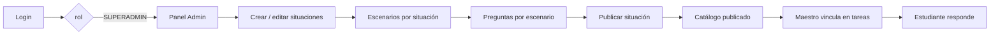

# Fase 0 — Módulo Administrador (Superadmin)

> **Estado:** análisis inicial + implementación base (Fase 1).  
> **Alcance:** solo rol **Administrador** (`SUPERADMIN`). Profesor y Estudiante quedan fuera de esta fase.

## 1. Acceso a fuentes oficiales

| Fuente | URL | Resultado del análisis |
|--------|-----|------------------------|
| Notion | [Certificación Workspace](https://www.notion.so/Certificaci-n-Workspace-en-Notion-35e7defba37d80629deff33be1171a5b) | **Sin acceso público** (página privada o requiere invitación). |
| Figma | [Sin título — node 24-616](https://www.figma.com/design/HxGHiqXaYKtcGdyc2Sw0PF/Sin-t%C3%ADtulo?node-id=24-616) | **No consultable** desde el entorno automatizado (timeout / autenticación). |

### Información pendiente (bloqueante para paridad 100 %)

Para alinear requisitos y UI con exactitud, se necesita **una** de estas opciones:

1. Invitar al workspace de Notion con permiso de lectura, o exportar las páginas relevantes a Markdown/PDF en `docs/notion/`.
2. Compartir el archivo Figma con enlace “Anyone with the link can view”, o exportar tokens (colores, tipografías, espaciados) y capturas del frame **Administrador** en `docs/figma/`.
3. Token de integración: Notion API (`NOTION_TOKEN` + `NOTION_DATABASE_ID`) o Figma API (`FIGMA_ACCESS_TOKEN` + file key).

Hasta entonces, este documento y el código se basan en:

- Modelo de dominio existente (`academy.models.ts`, `academy-data.service.ts`).
- Reglas ya implementadas en UI y comentarios del repositorio.
- Diseño del **login** (referencia Figma parcial ya codificada en `login.page.ts`).

---

## 2. Arquitectura propuesta

### 2.1 Principios

- **Feature-based:** cada rol en `src/app/features/<rol>/`.
- **Standalone components** (Angular 21), sin NgModules de feature.
- **Lazy loading** del módulo admin para reducir bundle inicial.
- **Signals** para estado de UI; servicios singleton para dominio.
- **Capa de aplicación** (`AdminCatalogService`) sobre persistencia (`AcademyDataService`).
- **Preparado para backend:** contratos en `admin-api.contracts.ts`; hoy implementación **in-memory + localStorage** (mismo store académico).

### 2.2 Capas

```
┌─────────────────────────────────────────────────────────┐
│  Vistas (pages) + componentes presentacionales          │
├─────────────────────────────────────────────────────────┤
│  AdminCatalogService (casos de uso del administrador)   │
├─────────────────────────────────────────────────────────┤
│  AcademyDataService (persistencia / seed / store)       │
├─────────────────────────────────────────────────────────┤
│  [Futuro] HttpAdminRepository → API REST                │
└─────────────────────────────────────────────────────────┘
```

### 2.3 Autenticación y autorización

| Elemento | Implementación |
|----------|----------------|
| Login | `AuthService` + `LoginPage` (`/login`) |
| Sesión | `localStorage` clave `academic-case-simulator-session-v2` |
| Guard | `roleGuard(['SUPERADMIN'])` en rutas `/admin/**` |
| Redirección post-login | `SUPERADMIN` → `/admin` |
| Legacy | `/superadmin` redirige a `/admin` |

### 2.4 Flujo general del sistema (solo contexto admin)



**Regla de negocio central (documentada en código):** el administrador **solo genera contenido del catálogo**. El maestro **vincula** situación, escenarios y preguntas a grupos mediante checklist. El estudiante **responde** tareas asignadas.

---

## 3. Funcionalidades del administrador (inferidas del dominio actual)

### 3.1 Implementadas en esta fase

| ID | Funcionalidad | Descripción |
|----|---------------|-------------|
| ADM-01 | Dashboard / resumen | Métricas: situaciones, publicadas, escenarios, preguntas del catálogo del admin. |
| ADM-02 | Gestión de situaciones | Crear situación (título, descripción, contexto, objetivo, dificultad). |
| ADM-03 | Ciclo de vida situación | Estados: `DRAFT`, `PUBLISHED`, `ARCHIVED`. |
| ADM-04 | Gestión de escenarios | Crear escenario ligado a situación (título, contexto, instrucciones, orden). |
| ADM-05 | Gestión de preguntas | Crear pregunta con categoría, opciones, retroalimentación, respuesta correcta. |
| ADM-06 | Cierre de sesión | Logout y retorno a login. |
| ADM-07 | Autorización | Acceso exclusivo rol `SUPERADMIN`. |

### 3.2 Por confirmar en Notion (no implementadas aún)

| ID | Funcionalidad probable | Notas |
|----|------------------------|-------|
| ADM-08 | CRUD usuarios (maestros / estudiantes) | Hoy lo hace parcialmente el maestro (`createStudent`). |
| ADM-09 | Edición / eliminación de situaciones, escenarios, preguntas | Solo creación + cambio de estado de situación. |
| ADM-10 | Reordenar escenarios / preguntas | `orderIndex` existe; falta UI drag-and-drop. |
| ADM-11 | Auditoría / bitácora | No hay entidad en el modelo. |
| ADM-12 | Configuración institucional | No modelado. |
| ADM-13 | Reportes globales | Resultados hoy son por grupo (vista maestro). |

---

## 4. Entidades relevantes (administrador)

| Entidad | Campos clave | Relación |
|---------|--------------|----------|
| `User` | `role: SUPERADMIN` | Creador de situaciones |
| `Situation` | status, difficulty, learningObjective | 1:N escenarios |
| `Scenario` | situationId, orderIndex | 1:N preguntas |
| `Question` | category, feedback | 1:N AnswerOption |
| `AnswerOption` | isCorrect | — |

**Publicación:** solo situaciones `PUBLISHED` alimentan `catalogSituations()` visible al maestro.

---

## 5. Estructura de carpetas (Fase 1)

```
src/app/
├── core/
│   └── guards/
│       └── role.guard.ts
├── shared/
│   └── ui/
│       ├── page-header/
│       ├── metric-card/
│       └── status-badge/
├── features/
│   ├── auth/
│   │   └── pages/login.page.ts          # (migración futura)
│   └── admin/
│       ├── admin.routes.ts
│       ├── data/
│       │   └── admin-api.contracts.ts
│       ├── layout/
│       │   └── admin-shell.component.ts
│       ├── services/
│       │   └── admin-catalog.service.ts
│       ├── components/
│       │   ├── admin-sidebar/
│       │   ├── situation-form/
│       │   ├── situation-list/
│       │   ├── scenario-form/
│       │   ├── scenario-list/
│       │   ├── question-form/
│       │   └── question-list/
│       └── pages/
│           ├── admin-dashboard.page.ts
│           ├── admin-situations.page.ts
│           ├── admin-scenarios.page.ts
│           └── admin-questions.page.ts
├── models/
│   └── academy.models.ts
└── services/
    ├── auth.service.ts
    └── academy-data.service.ts
```

---

## 6. Diseño visual (referencia Figma parcial)

Tokens alineados al login existente (`login.page.ts` + `styles.css`):

| Token | Valor |
|-------|--------|
| Primary | `#0050cb` |
| Primary dark | `#003fa4` |
| Accent | `#00626f` |
| Background | `#f7f9fb` |
| Text | `#191c1e` |
| Muted | `#424656` |
| Tipografía | Inter (+ Hanken Grotesk en títulos de marca) |
| Iconografía | Material Symbols Outlined |
| Sidebar admin | Gradiente oscuro `#111827` → azul institucional |
| Radius | `8px` |
| Shell max-width contenido | `1440px` |

Archivo centralizado: `src/styles/design-tokens.css`.

---

## 7. Rutas (admin)

| Ruta | Vista |
|------|--------|
| `/admin` | Redirect → `/admin/resumen` |
| `/admin/resumen` | Dashboard |
| `/admin/situaciones` | Situaciones |
| `/admin/escenarios` | Escenarios |
| `/admin/preguntas` | Preguntas |
| `/superadmin` | Redirect legacy → `/admin` |

---

## 8. Próximos pasos (Fase 2+)

1. Incorporar export Notion/Figma y cerrar brechas ADM-08…ADM-13.
2. Sustituir `AcademyDataService` por API HTTP manteniendo `AdminCatalogService`.
3. Tests e2e del flujo publicar situación → maestro asigna tarea.
4. Módulos Profesor y Estudiante (fases separadas).

---

## 9. Registro de avances

| Fecha | Avance |
|-------|--------|
| 2026-05-26 | Fase 0 documentada; brechas Notion/Figma identificadas. |
| 2026-05-26 | Fase 1: estructura `features/admin`, rutas lazy, shell y vistas modulares. |
