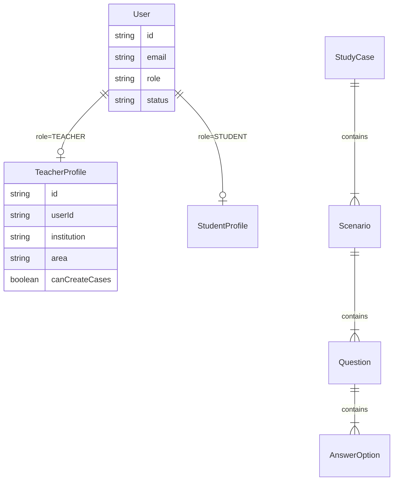
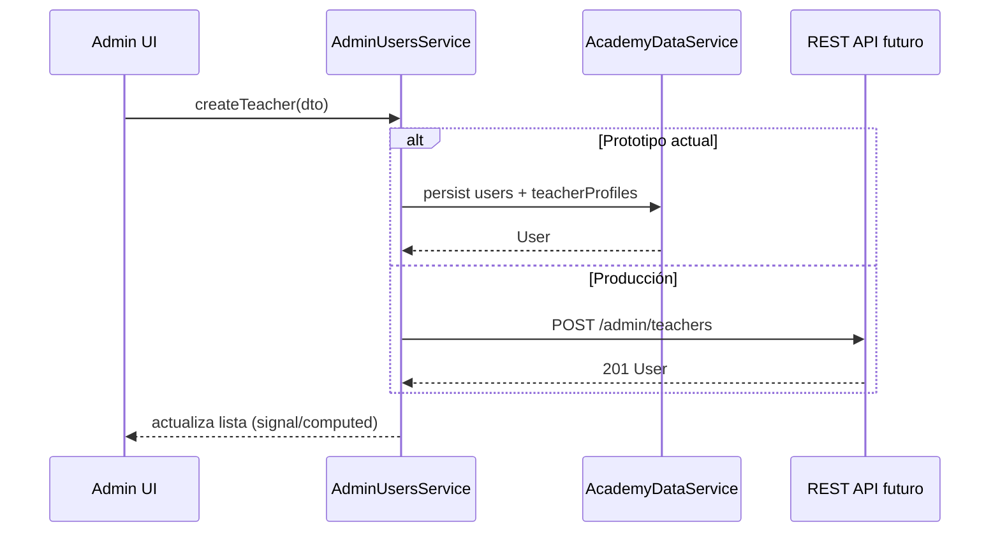

# Fase 1 — Especificación módulo Administrador

Fuente analizada:

| Archivo | Contenido |
|---------|-----------|
| `docs/notion/export/Requisitos Funcionales csv *.csv` | REQ-01 … REQ-15 (matriz oficial) |
| `docs/notion/export/Certificación & Workspace en Notion *.pdf` | Caso de estudio académico, objetivos, matriz RF |
| `docs/notion/export/extracted.txt` | Texto extraído del PDF |
| `docs/PSYCH-SIMULATOR - Dashboard Administrativo Neo.png` | UI Figma administrador |
| `docs/figma/` | Carpeta destino de assets (PNG administrativo copiado) |

**Nota:** El export de Notion no incluye archivos separados de casos de uso, historias, NFR ni diagramas UML; esos elementos aparecen implícitos en la matriz RF y en el caso de estudio. Los certificados PDF adjuntos no aportan requisitos del simulador.

---

## 1. Resumen ejecutivo

**MIND-SPHERE** es un simulador académico de casos clínicos/psicosociales con jerarquía **Caso → Escenario → Pregunta → Opciones**, agendamiento docente, ejecución estudiantil con cronómetro y calificación por rúbrica.

El **Administrador** (Notion: *Administrador* / código: `SUPERADMIN`) según **REQ-01** gestiona **usuarios, roles y el flag “creador de casos”** para docentes. **No** formula casos (eso es **REQ-02**, rol Docente).

El diseño Figma **Dashboard Administrativo Neo** presenta un panel de **plataforma**: métricas, usuarios, licencias, nodos, reportes institucionales y logs — coherente con REQ-01 y operación del sistema.

---

## 2. Requisitos del administrador

| ID | Nombre | Prioridad | Regla de negocio |
|----|--------|-----------|------------------|
| **REQ-01** | Gestión de usuarios y permisos | Alta | Solo administradores gestionan roles; solo docentes **autorizados** (`canCreateCases`) crean casos. |

Criterio de aceptación REQ-01: *El administrador puede crear perfiles y asignar el flag de creador de casos.*

### Requisitos del sistema NO asignados al admin (referencia)

| IDs | Rol principal |
|-----|----------------|
| REQ-02 … REQ-06, REQ-15 | Docente |
| REQ-07 … REQ-09, REQ-12 | Estudiante |
| REQ-04, REQ-05, REQ-09 … REQ-11, REQ-14 | Sistema (correos, CRON, notas) |

---

## 3. Funcionalidades administrador (implementación Fase 1)

| Código | Funcionalidad | REQ / Figma |
|--------|---------------|-------------|
| ADM-DASH | Dashboard métricas plataforma | Figma |
| ADM-USR-01 | Listar usuarios (docente / estudiante / admin) | REQ-01 |
| ADM-USR-02 | Crear docente con institución y área | REQ-01 |
| ADM-USR-03 | Crear estudiante con código académico | REQ-01 |
| ADM-USR-04 | Activar / desactivar usuario | REQ-01 |
| ADM-USR-05 | Asignar / quitar flag **creador de casos** | REQ-01 |
| ADM-LIC | Vista control de licencias (datos mock → API) | Figma |
| ADM-REP | Reportes uso institucional | Figma |
| ADM-LOG | Consola logs del sistema | Figma |
| ADM-LOCK | Bloqueo de emergencia (deshabilita sesiones docentes) | Figma |

**Fuera de alcance admin (Fase 2+):** REQ-02 estructuración de casos → módulo **Profesor**.

---

## 4. Entidades y relaciones

| Entidad | Responsable creación |
|---------|---------------------|
| User, TeacherProfile.canCreateCases | **Administrador** |
| StudyCase (Caso), Scenario, Question | **Docente autorizado** |
| Session / Schedule | **Docente** |
| StudentAnswer, Progress | **Estudiante** |

---

## 5. Arquitectura frontend

- **Angular 21** standalone, signals, OnPush.
- **Feature** `features/admin` con lazy routes.
- **Servicios:**
  - `AdminUsersService` — REQ-01 (usuarios / permisos).
  - `AdminPlatformService` — métricas, logs, licencias (mock; contrato API listo).
  - `AcademyDataService` — persistencia localStorage (prototipo).
- **Capa API futura:** `AdminApiRepository` implementando interfaces en `data/admin-api.contracts.ts`.

---

## 6. Flujo frontend / backend

Endpoints sugeridos:

| Método | Ruta | Descripción |
|--------|------|-------------|
| GET | `/api/admin/metrics` | Métricas dashboard |
| GET | `/api/admin/users` | Listado con filtros |
| POST | `/api/admin/teachers` | Alta docente + `canCreateCases` |
| POST | `/api/admin/students` | Alta estudiante |
| PATCH | `/api/admin/users/:id/status` | ACTIVE / INACTIVE |
| PATCH | `/api/admin/teachers/:id/can-create-cases` | Flag creador |
| POST | `/api/admin/emergency-lockout` | Bloqueo emergencia |

---

## 7. Diseño Figma (tokens)

| Token | Valor |
|-------|--------|
| `--admin-bg` | `#0B0E14` |
| `--admin-surface` | `#151A24` |
| `--admin-surface-raised` | `#1C2230` |
| `--admin-primary` | `#FF2D95` |
| `--admin-accent` | `#00F2FF` |
| `--admin-warning` | `#F5A623` |
| `--admin-text` | `#F4F6FB` |
| `--admin-muted` | `#8B95A8` |
| Tipografía | Inter, monoespaciada en logs |

Archivo: `src/app/features/admin/styles/admin-theme.css`.

---

## 8. Estructura de carpetas

Ver implementación en `src/app/features/admin/`.

---

## 9. Brechas documentales

| Elemento | Estado |
|----------|--------|
| Requisitos no funcionales explícitos | No exportados — inferidos: seguridad por rol, WCAG, responsive |
| Casos de uso / historias formales | Solo inferibles desde CSV |
| Diagramas de arquitectura | No exportados |
| `docs/figma/` múltiples frames | Solo PNG administrativo en `docs/` |
